# 【译】Defensive CSS(防御性CSS)

## 特别声明

本文是作者 [Ahmad Shadeed](https://twitter.com/shadeed9) 发布在[网站](https://defensivecss.dev/)上的Tips整理。  

版权归原作者所有。  

由于笔者所学有限，翻译(deepL + 少量人工改动)难免有所纰漏，欢迎批评指正。

本文仅作个人学习记录，欢迎阅读[英文原文](https://defensivecss.dev/tips/)。

## Tips

### 1、Flexbox Wrapping(flex 布局自动换行)
CSS flexbox是目前最有用的CSS布局功能之一。在一个父容器上添加 `display: flex`，让子项挨着排序，这很有诱惑力。

问题是，当空间不足时，那些子项默认不会被包裹成一个新的行。我们需要用 `flex-wrap: wrap` 来改变这一行为。

```css
.content {
    display: flex;
    flex-wrap: wrap;
}
```

### 2、Image Distortion(避免图像失真)
当我们不能控制网页上的图像长宽比时，最好提前考虑，当用户上传的图像不符合长宽比时，提供一个解决方案。我们可以通过 `object-fit: cover` 保证图片不失真。


```css
img {
    object-fit: cover; 
    // 被替换的内容在保持其宽高比的同时填充元素的整个内容框。如果对象的宽高比与内容框不相匹配，该对象将被剪裁以适应内容框。
}
```

### 3、Long Content(长文本截断)
对于不太重要的长文本或者由用户生成的长度不定的文本，在有些情况下截断是个不错的方法。

```css
.content {
    white-space: nowrap;
    overflow: hidden;
    text-overflow: ellipsis;
}
```

### 4、Component Spacing(预设组件间间距)
组件的大小有时是不固定的，有时组件较小时，不明显的问题；当组件大小变化时，就可能会挤压/碰撞。所以提前考虑组件间的间距是必要的。

```css
.content {
    margin-right: 1rem;
}
```

### 5、Auto-fit Vs Auto-fill(正确使用 `auto-fit` 与 `auto-fill`)
在使用CSS gird 布局 `minmax()` 函数时，决定是使用 `auto-fit` 还是 `auto-fill` 关键字是非常重要的。一旦使用不当，会导致意外的结果。
当使用 `minmax()` 函数时，`auto-fit` 关键字将扩展网格项目以填补可用空间。而 `auto-fill` 将保留可用的空间，而不改变网格项的宽度。


也就是说，使用 `auto-fit` 可能会导致网格项目太宽，特别是当它们小于预期时。考虑一下下面的例子。

```css
.wrapper {
    display: grid;
    grid-template-columns: repeat(auto-fit, minmax(250px, 1fr));
    grid-gap: 1rem;
}
```


大多数时候，这样的行为是不需要的，所以在我看来，使用 `auto-fill` 是更好的。

```css
.wrapper {
    display: grid;
    grid-template-columns: repeat(auto-fill, minmax(250px, 1fr));
    grid-gap: 1rem;
}
```


有时适当使用css变量也是不错的。
```css
.wrapper {
  --sizing: auto-fit;
  display: grid;
  grid-template-columns: 
  repeat(var(--sizing), minmax(100px, 1fr));
  grid-gap: 1rem;
}
```

### 6、Background repeat(大屏背景图重复)
很多时候，当使用一张大的图片作为背景时，我们往往会忘记考虑设计在大屏幕上观看时的情况。该背景将默认重复。

这在笔记本电脑的屏幕上大多不会看到，但在大屏幕上可以清楚地看到。

为了提前避免这种情况的发生，确保重置 `background-repeat`.

```css
.image {
    background-image: url('..');
    background-repeat: no-repeat;
}
```

### 7、CSS grid fixed values(CSS网格的固定值)

假设我们有一个 grid 布局的容器，其中它包含一个侧边栏和一个主体。CSS看起来像这样：

```css
.wrapper {
    display: grid;
    grid-template-columns: 250px 1fr;
    gap: 1rem;
}
```

由于缺乏空间，这在小的视口尺寸上会出现问题。为了避免这样的问题，在使用上述CSS网格时，一定要使用媒体查询。

```css
@media (min-width: 600px) {
    .wrapper {
        display: grid;
        grid-template-columns: 250px 1fr;
        gap: 1rem;
    }
}
```

### 8、CSS Variable Fallback(CSS变量设置回退值)

CSS变量在网页设计中得到了越来越多的使用。我们可以应用一种方法，在CSS变量值因某种原因为空的情况下，以一种不破坏体验的方式使用它们。

这在通过Javascript输入CSS变量的值时特别有用。下面是一个例子：

```css
.message__bubble {
    max-width: calc(100% - var(--actions-width));
}
```

变量 `--actions-width` 在 `calc()` 函数中被使用，其值来自Javascript。假设Javascript由于某种原因失败了，会发生什么？最大宽度将被计算为零。

我们可以提前避免这种情况，在 `var()` 中添加一个回退值。

```css
.message__bubble {
    max-width: calc(100% - var(--actions-width, 70px));
}
```

这样一来，如果这个变量没有被定义，就会使用后备的70px。这种方法可以在变量有可能失效的情况下使用（例如：来自Javascript）。

### 9、Fixed sizes(固定尺寸)

破坏布局的常见情况之一是对一个有不同长度内容的元素使用固定的宽度或高度。

用 `min-width` 替换 `width` ，使用 `min-height` 替换 `height`。

### 10、Minimum Content Size In CSS Flexbox(CSS flex 布局的最小内容尺寸)

如果一个flex项目中的文本元素或图像比项目本身大，浏览器就不会收缩它们。这就是Flexbox的默认行为。

即使我们使用 `overflow-wrap: break-word`，也不会起作用。

要改变这种默认行为，我们需要将flex项目的 `min-width` 设置为 0。 这是因为 `min-width` 的默认值是 `auto`，溢出会发生。

```css
.container {
    overflow-wrap: break-word;
    min-width: 0;
}
```

### 13、Minimum Content Size In CSS grid(CSS grid 布局的最小内容尺寸)

与flexbox类似，CSS grid对其子项目有一个默认的最小内容尺寸，即 `auto`。这意味着，如果有一个元素比网格项大，它将溢出。

为了解决这个问题，我们有三种不同的解决方案：

1. 使用 `minmax()`
2. 对网格项应用` min-width`
3. 给网格项添加 `overflow: hidden`

```css
.slider {
    display: flex;
}

.page {
    display: grid;
    grid-template-columns: 1fr 100px;
    grid-gap: 1rem;
}

.page__item--main {
    min-width: 0;
}
```

### 14、Grouping vendor selectors(分组不同浏览器选择器)

我们不建议将那些需要在不同浏览器上使用的选择器分组。例如，为一个输入的占位符设计样式，需要在每个浏览器上使用多个选择器。根据w3c的规定，如果我们把选择器分组，整个规则就会失效。

```css
/* 请不要这样做 */
input::-webkit-input-placeholder,
input:-moz-placeholder {
    color: #222;
}
```

```css
/* 相反，你应该这样做 */
input::-webkit-input-placeholder {
    color: #222;
}

input:-moz-placeholder {
    color: #222;
}

```

### 15、Image maximum width(设置图像最大宽度)

作为一般规则，不要忘记给所有图片设置 `max-width: 100%`。这可以被添加到你使用的CSS重置中。

```css
img {
    max-width: 100%;
    object-fit: cover;
}
```

### 16、Position sticky with CSS Grid(CSS grid 布局中的 position: sticky)

你有没有试过对网格容器的一个子项使用 `position: sticky` ？网格项目的默认行为是 `stretch`。结果是，下面的例子中的旁置元素等于主部分的高度。

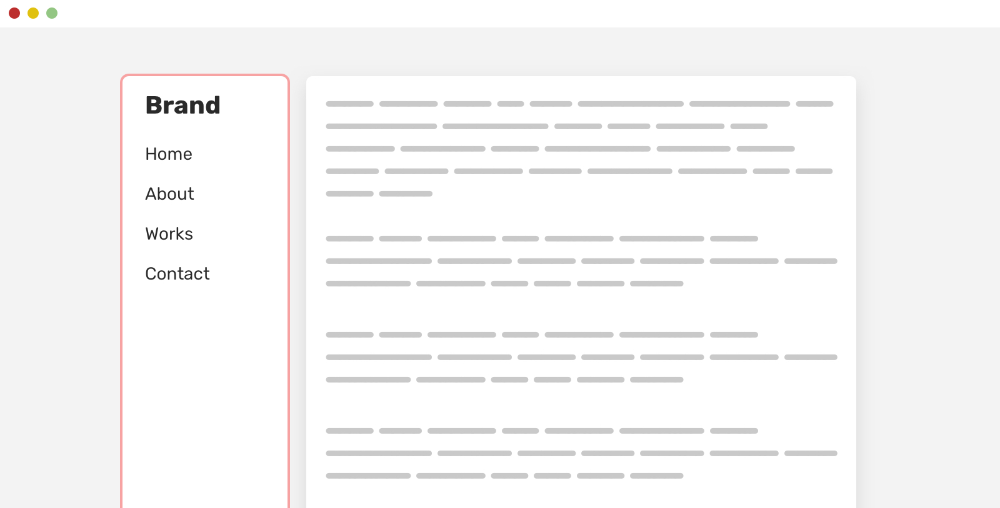

为了使它像预期的那样工作，你需要重置 `align-self` 属性。

```css
aside {
    align-self: start;
    position: sticky;
    top: 1rem;
}
```

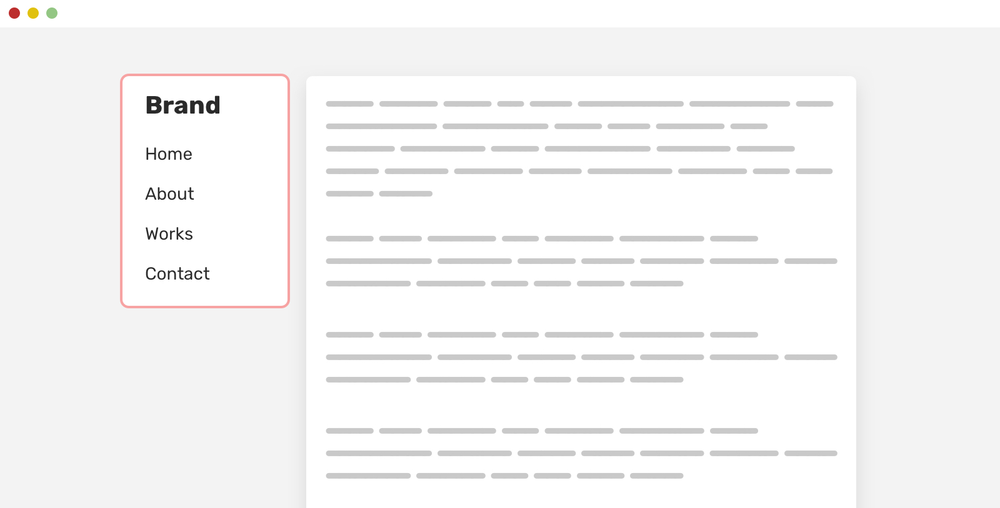

### 17、Scroll chaining(滚动链)

你是否曾经打开一个Modal并开始滚动，然后当你到达终点并继续滚动时，模态下面的内容（主体元素）会滚动？这就是所谓的滚动链。

在下图中，你可以看到默认的滚动链行为。

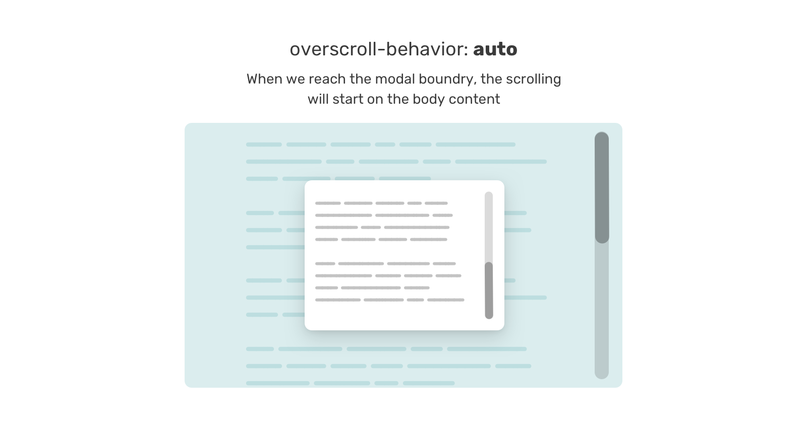

为了提前避免这种情况，我们可以将其添加到任何需要滚动的组件中（例如：聊天组件、移动菜单...等）。这个属性的好处是，在有滚动之前，它不会产生影响。

```css
.modal__content {
    overscroll-behavior-y: contain;
    overflow-y: auto;
}
```

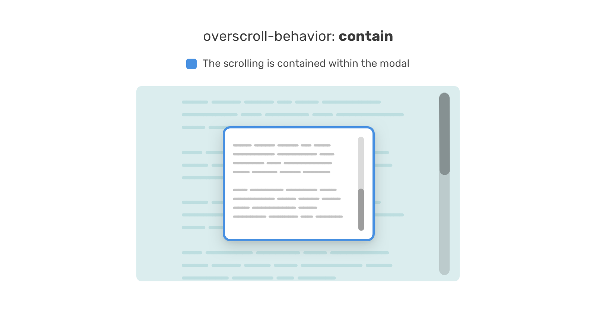

### 18、Scrollbar gutter(滚动条宽度)

另一件与滚动有关的事情是滚动条的沟槽。以前面的例子为例，当内容变长时，增加一个滚动条会导致布局的转移。布局移动发生的原因是为滚动条保留了一个空间。

请看下图。

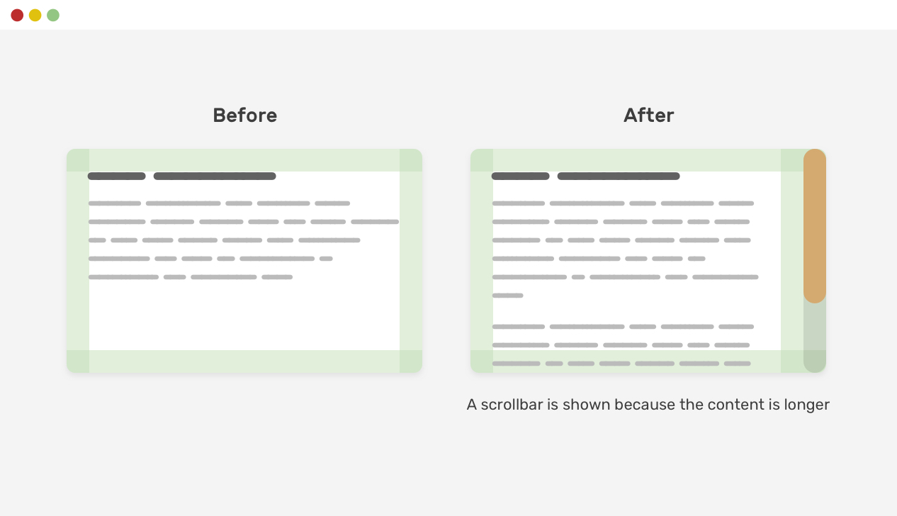

请注意，由于显示了滚动条，当内容变长时，它是如何移位的。我们可以通过使用scrollbar-gutter属性来避免这种行为。

```css
.element {
    scrollbar-gutter: stable;
}
```


### 19、Scrollbars on demand(按需要设置滚动条)

幸运的是，只有在内容较长的情况下，我们才能控制是否显示滚动条。也就是说，我们强烈建议使用 `auto` 作为 `overflow` 的值。

请考虑以下例子。


请注意，即使内容很短，也有一个滚动条可见。这对一个用户界面来说并不是好事。作为一个设计师，在不需要滚动条的情况下看到滚动条是很混乱的。

```css
.element {
    overflow-y: auto;
}
```

使用 `overflow-y: auto`，滚动条只有在内容较长时才可见。否则，它就不存在了。下面是一个更新的图。

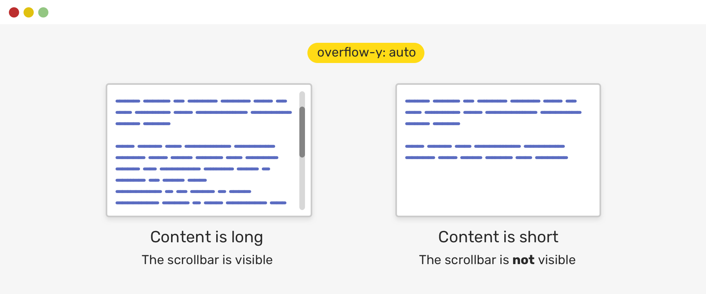

### 20、Using space-between(使用 `space-between`)

在一个 flex 布局的容器中，你可能会使用 `justify-content` 来使子项目之间有一定的间距。如果有一定数量的子项目，布局看起来会很好。然而，当它们增加或减少时，布局会看起来很奇怪。

请考虑以下例子。

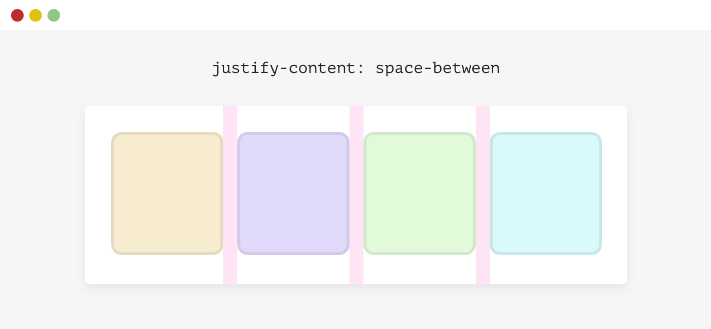

我们有一个有四个项目的 flex布局容器中。每个项目之间的间距不是间隙或空白，它之所以存在是因为容器有 `justify-content: space-between`。

```css
.wrapper {
    display: flex;
    flex-wrap: wrap;
    justify-content: space-between;
}
```

当项目的数量少于4个时，将发生以下情况。

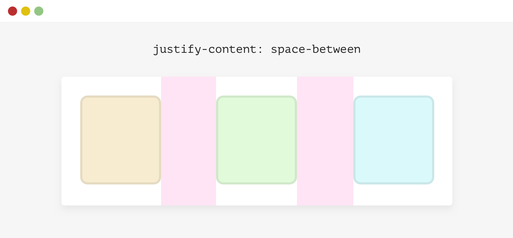

这并不是好事。对此有不同的解决方案：

1. 添加 `margin`；
2. Flexbox gap (谨慎使用)；
3. `padding` (可应用于每个子元素的父元素)；
4. 添加空元素作为间隔。

```css
.wrapper {
  	// 使用gap解决问题
    display: flex;
    flex-wrap: wrap;
    gap: 1rem;
}
```

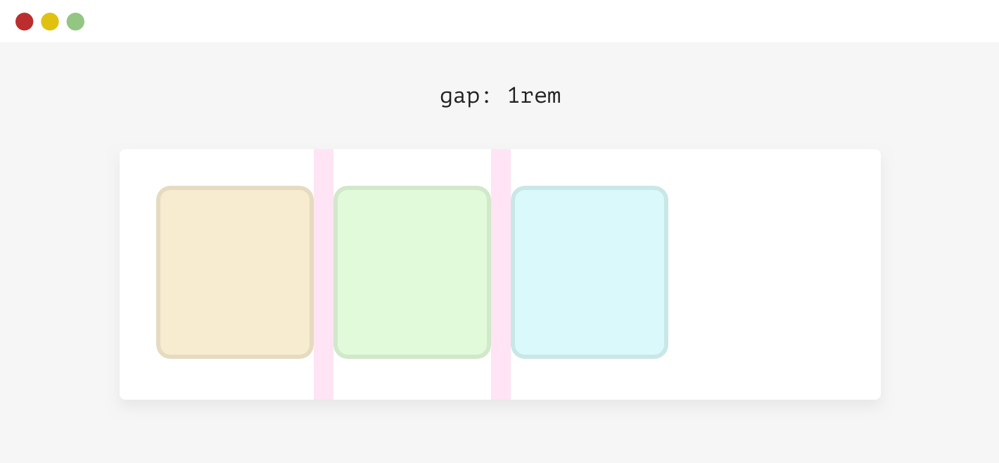

### 21、Text over image(图像上添加文字)

当使用图像上的文本方法时，必须考虑到图像无法加载的情况。文本会是什么样子？

我们通过给元素添加一个背景色来轻松解决这个问题。这个背景只有在图片加载失败时才会显示出来。这不是很酷吗？

```css
.card__img {
  	// 个人感觉实现效果一般，可以考虑UI重新设计一下
    background-color: grey;
}
```

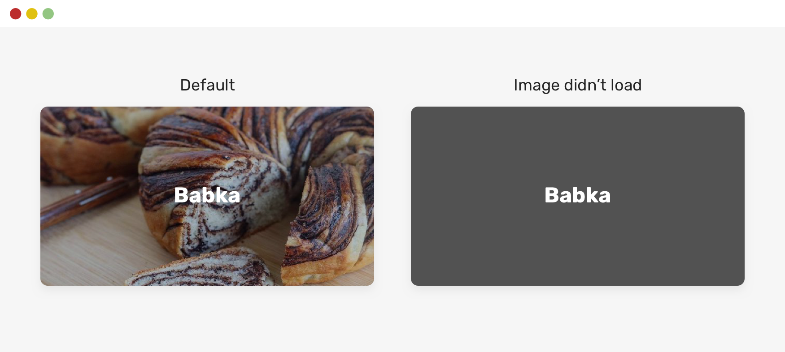

### 22、Vertical media queries(垂直媒体查询)

这里有一个我见过很多次的问题。我们有一个带有主要和次要链接的侧边栏组件。次要链接应该位于侧边栏部分的最底部。

考虑一下下面的例子。主导航和次导航看起来还不错。在我看到的这个例子中，开发者给二级导航添加了 `position: sticky`，这样它就可以粘在底部了。

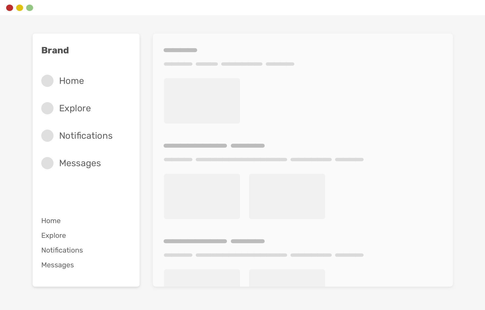

然而，如果浏览器的高度较小，事情就会变得糟糕了。注意这两个导航是如何重叠的。

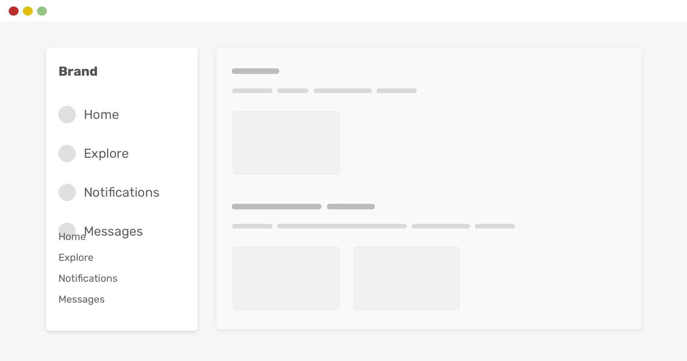

通过使用CSS垂直媒体查询，我们可以避免这个问题。

这样，只有当视口高度大于或等于600px时，二级导航才会被粘在底部。好多了，对吗？

也许有更好的方法来实现这一行为（比如使用 `margin: auto`），但我在这个例子中专注于垂直查询。

如果我想解释使用CSS垂直媒体查询，我需要写一篇完整的文章来说明。好消息是，我已经写了[一篇](https://ishadeed.com/article/responsive-design-height/)，如果你有兴趣的话。

### 23、Accidental hover on mobile(在手机上意外地悬停)

我们使用悬停效果来向用户提供一个指示，表明一个元素是可点击的或活动的。这对于有鼠标或触控板的设备来说是不错的。然而，对于移动浏览来说，悬停效果会让人感到困惑。

当在一个页面中滚动时，你的手指可能会不小心做点触，这将触发一个特定元素的悬停状态。

请看下图。


当用户在滚动时，一个悬停被触发了。在这一点上，用户根本不是故意要这么做的，因为在移动端没有悬停。

解决这个问题的方法是使用悬停媒体查询。它可以检测用户当前的输入工具（触控板与鼠标）是否可以在元素上悬停。

```css
@media (hover: hover) {
    .card:hover {
        /* 添加悬停的样式 */
    }
}
```

这样，只有当用户使用鼠标或触控板等工具设备时，悬停样式才会发挥作用。

### 24、Image inner border(图像内边界)

在处理用户头像时，以清晰的方式显示它们可能是一个挑战。这是因为有些图片太亮了，因此它可能与下面的背景融合在一起，特别是如果它是白色的。

请看下图。

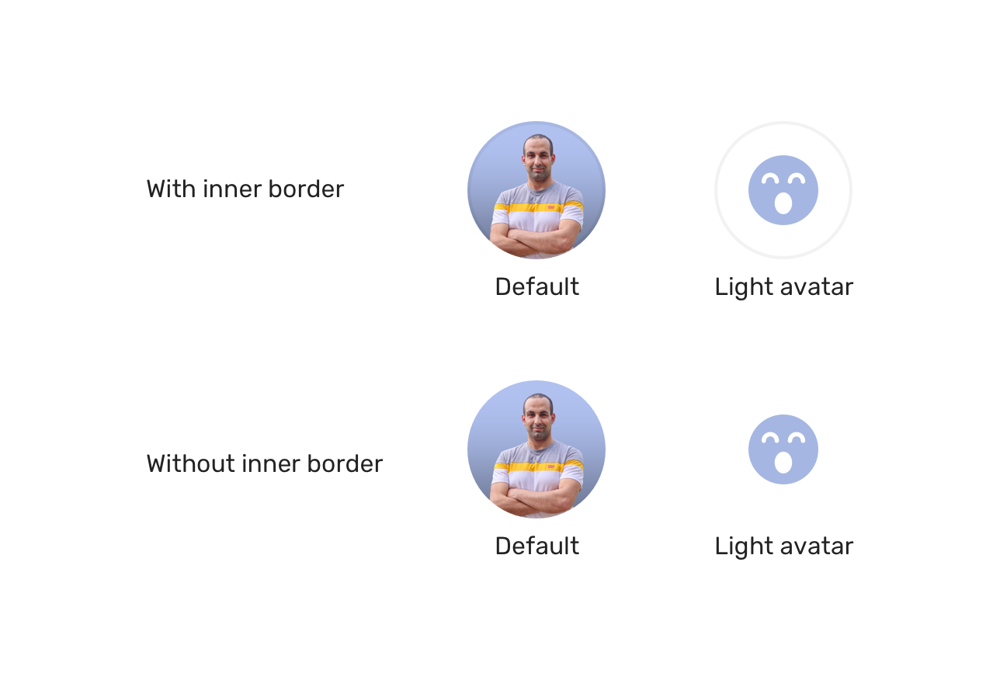

注意到在第二行中，第二个头像是如何与白色背景混合在一起的。然而，当我们有一个边框时，情况就会好很多。

我们可以提前预防，给图片添加一个内边框。不仅如此，我们还可以考虑一下暗色模式

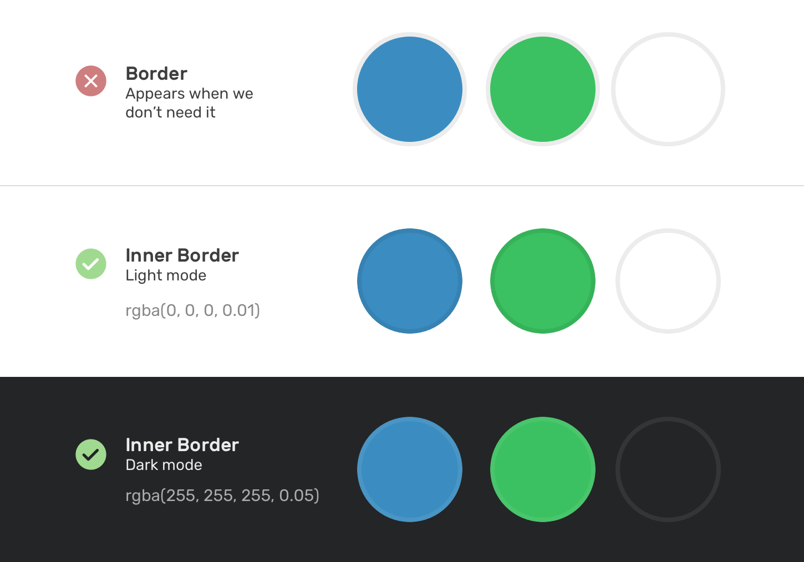

在CSS中，我们可以通过使用内嵌盒状阴影来模仿内边界。但问题是，我们不可能为元素添加内嵌阴影。因此，我们需要将图像包裹在另一个元素中，并对其应用内阴影。

```html
<div class="card__avatar">
  
  <div class="border"></div>
</div>
```

```css
.card__avatar {
  position: relative;
}

.card__avatar img {
  width: 56px;
  height: 56px;
  border-radius: 50%;
}

.border {
  position: absolute;
  width: 56px;
  height: 56px;
  border: 2px solid #000;
  border-radius: 50%;
  opacity: 0.1;
}
```

### 25、Default flexbox stretching(默认的Flexbox拉伸方式)

在flexbox中，flex项目的默认行为是 `stretch`。如果一个子项目的内容比它的兄弟姐妹长，这将导致另一个项目被拉伸。

除非我们在一个柔性项目中添加比预期更长的内容，否则这一点不容易被发现。

考虑一下下面的HTML和图。我们有一个包含头像、姓名和传记的组件。

```css
<div class="person">
    
    <div class="person__content">
        <h3>Ahmad Shadeed</h3>
        <p><!-- Description goes here.. --></p>
    </div>
</div>
```

```css
.person {
    display: flex;
}
```

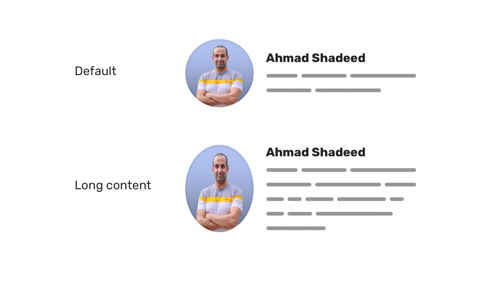

当人物描述内容（`.person__content` 元素）超过了头像的高度，这将导致头像的拉伸。

为了解决这个问题，我们需要覆盖默认的拉伸行为，使头像与它的父元素的起点（或中心）保持一致。

```css
.person__avatar {
    /* other styles */
    align-self: start;
}
```

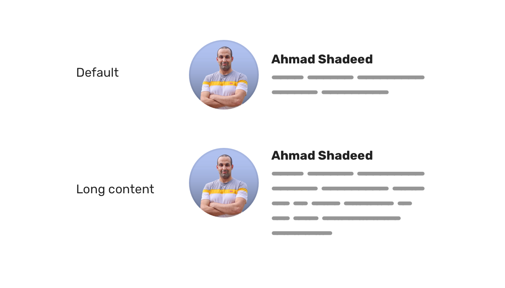

或者你可以在父元素上使用 `align-items: center`。只要是最适合你的情况就可以了。

```css
.person {
    display: flex;
    align-items: center;
}
```

### 26、Input zoom on iOS Safari(在iOS Safari上输入框缩放)

在iOS Safari中，当聚焦一个输入框时，整个网页会默认为缩放。这是Safari浏览器中的一个常见行为。这很烦人，因为在缩放页面时，由于输入不再被聚焦，它不会放大。

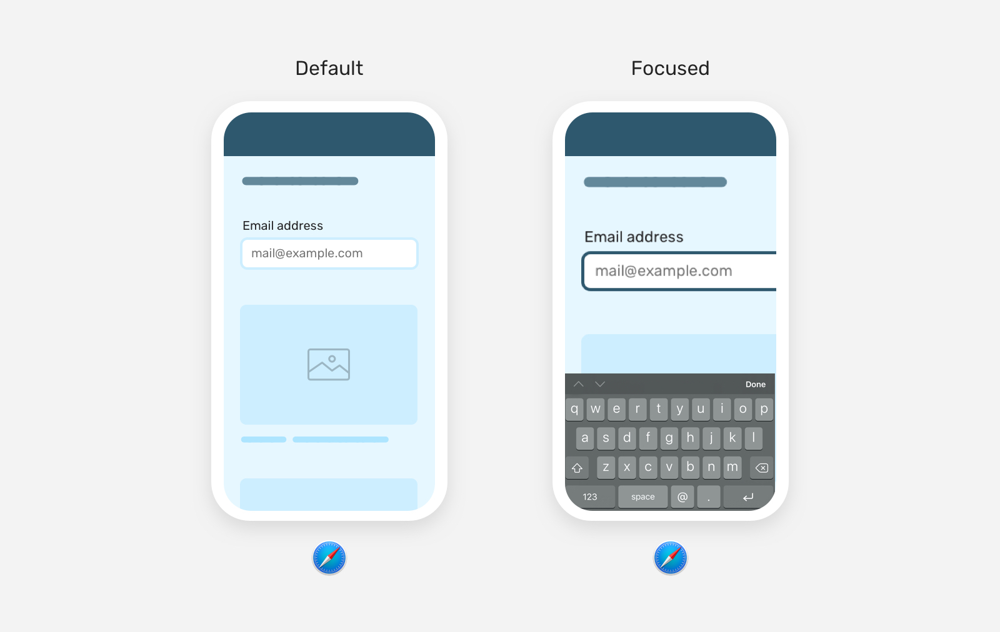

解决办法相当简单，那就是在输入框添加 `font-size: 16px`。

```css
input {
    font-size: 16px;
}
```

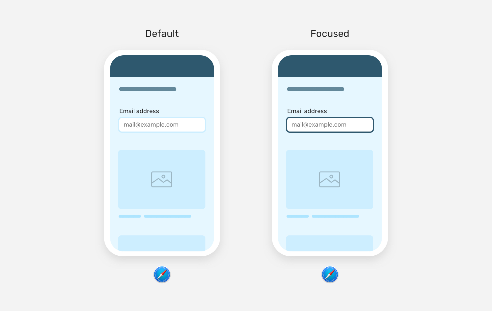

### 27、Button minimum width(按钮最小宽度)

一个常见的错误是假设一个按钮的宽度应该等于它的内容加上水平填充。这对于一个单一语言的网站（例如：英语）来说，可能会有预期的效果，但对于多语言的网站来说，这很容易失败。

请看下面的例子。

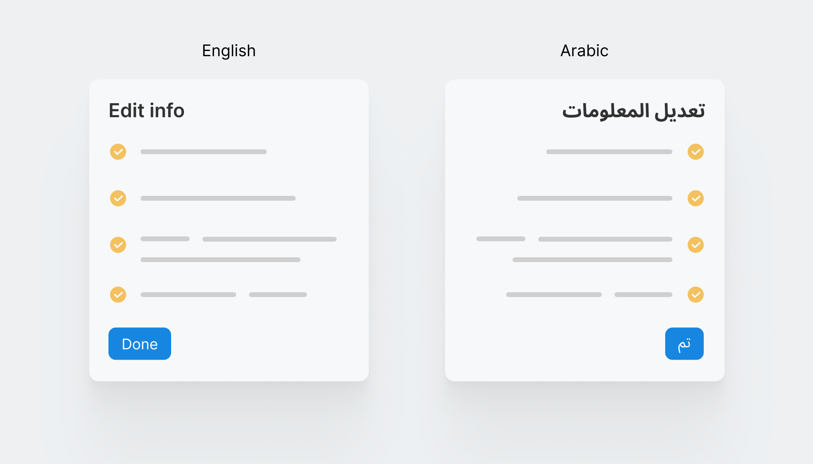

在左边，按钮的宽度很好，因为 "Done "这个词足够长。然而，在阿拉伯语中，它被翻译成 "تم"，因此，按钮的宽度变得太小。从用户体验的角度来看，这并不好，因为一个行动呼吁按钮必须足够大，特别是对于触摸来说。

为了避免这种情况，我们可以事先为按钮设置一个最小宽度。

```css
.button {
  min-width: 90px;
}
```

## 参考

1. https://defensivecss.dev/tips/